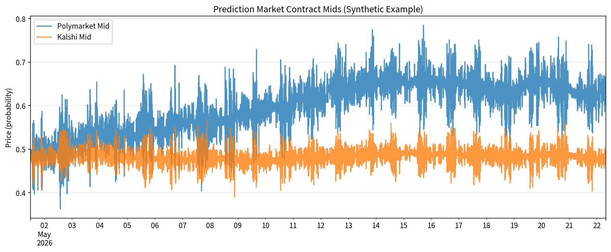
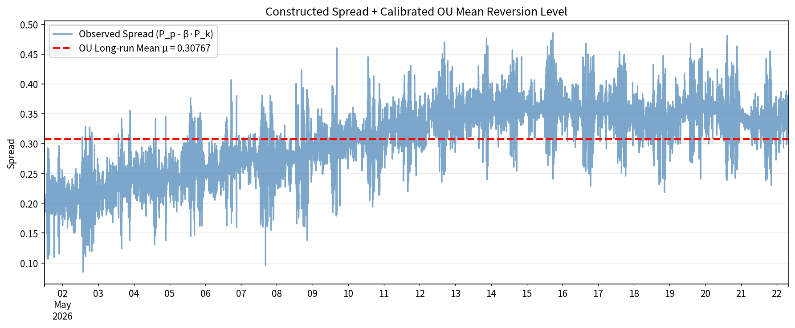

# Prediction Market Quant Arbitrage Pipeline

**End-to-end Python framework** for statistical arbitrage between prediction markets (Polymarket, Kalshi, etc.) using cointegration, Ornstein-Uhlenbeck calibration, order-book-inspired signals, and portfolio construction.

Built following the concepts from @ridark_eth's thread on quantitative hedge fund techniques for prediction market spreads.

## Demo

Charts below come from a run of `python prediction_market_arb_pipeline.py` on the built-in synthetic data. Outputs land next to the script, or in `QUANT_ARTIFACTS_DIR` if set.

| Synthetic Polymarket vs Kalshi mids | Spread vs calibrated OU mean |
|---|---|
|  |  |

## Features
- Realistic synthetic data generator (regimes, shocks, latency, time-of-day effects)
- Engle-Granger + **Johansen cointegration** testing
- OU process calibration (MLE via OLS on discretized form)
- Improved mean-reversion signals with momentum confirmation
- Position sizing based on OU parameters (z-score scaled or vol-target)
- Single-asset + **multi-asset portfolio backtesting** (correlation-aware min-variance, equal-risk)
- Rich diagnostics: rolling beta, residual analysis, equity curves, etc.
- **Full Streamlit UI dashboard** with existing charts + live WebSocket feed integration
- Git-tracked development with regular commits

## Quick Start
```bash
git clone https://github.com/Steeve-Crypto/Quant-CLI && cd Quant-CLI
pip install -r requirements.txt
python prediction_market_arb_pipeline.py          # Full pipeline + backtests
streamlit run streamlit_dashboard.py             # Interactive dashboard (install streamlit first)
```

**Dashboard Features**:
- All existing charts and diagnostics
- Live market monitor with OBI
- Interactive parameter controls
- Portfolio overview
- Live feed simulation

This runs the full pipeline:
- Generates synthetic data
- Performs cointegration + beta estimation
- Calibrates OU
- Runs single + multi-asset backtests
- Saves all plots, processed data, and results JSON

## Files Overview
- `prediction_market_arb_pipeline.py` — Main pipeline
- `ou_calibration.py` — Core OU calibration module
- `*.pkl` — Synthetic/processed data
- `*.png` — All diagnostic and equity plots
- `pipeline_results.json` — Full run summary
- `streamlit_dashboard.py` — Full interactive UI (Streamlit)
- `README.md`, `Specs.md` — Documentation

## Real-World Use Cases
1. **Election / Political Markets**: Calibrate spreads between Polymarket and Kalshi on the same race. Use portfolio across multiple states/events for diversified mean-reversion trading.
2. **Crypto / Macro Events**: Trade Fed rate decisions, ETF approvals, or token launches across platforms. The multi-asset version allocates across correlated outcomes.

## Deployment Instructions

### 1. Local Development (Recommended for Testing)
```bash
cd Quant-CLI

# Install dependencies
pip install -r requirements.txt   # or install individually:
# pip install pandas numpy scipy statsmodels matplotlib plotly dash streamlit requests websockets python-dotenv

# Run full pipeline + backtests
python prediction_market_arb_pipeline.py

# Run main dashboard (Dash + Plotly - recommended)
python dashboard.py
```

### 2. Docker Deployment (Recommended for Production)
Create a `Dockerfile` in the project root:

```dockerfile
FROM python:3.11-slim

WORKDIR /app
COPY . /app

RUN pip install --no-cache-dir -r requirements.txt

EXPOSE 8050
CMD ["python", "dashboard.py"]
```

Build and run:
```bash
docker build -t pm-quant-arb .
docker run -p 8050:8050 pm-quant-arb
```

### 3. Cloud Deployment Options
- **Render / Railway / Fly.io**: Connect GitHub repo → set `python dashboard.py` as start command. Port 8050.
- **Heroku**: Add `Procfile` with `web: python dashboard.py`.
- **AWS / GCP / Azure**: Use container service or App Runner with the Dockerfile above.
- **Streamlit Community Cloud**: Push `streamlit_dashboard.py` (free tier available).

### 4. Environment Variables (for Real API Execution)
Create a `.env` file:
```env
POLYMARKET_API_KEY=your_key
POLYMARKET_PRIVATE_KEY=your_wallet_private_key
KALSHI_API_KEY=your_key
KALSHI_API_SECRET=your_secret
```

**Important**: Never commit `.env` or private keys. Real trading requires proper risk management and testing in paper mode first.

### 5. Production Recommendations
- Run with `gunicorn` or `uvicorn` for better performance if scaling the dashboard.
- Use a reverse proxy (Nginx) + HTTPS.
- Add logging, monitoring (Prometheus/Grafana), and alerts for high latency or drawdowns.
- Schedule the pipeline daily via cron or cloud scheduler.

## Requirements
See `requirements.txt`.

3. **Sports / Awards**: Oscar predictions, Super Bowl props — fast mean-reversion on liquidity imbalances.
4. **Backtesting Strategy Ideas**: Load your own L2 Parquet data (mid prices) and run the pipeline to evaluate cointegration strength, reversion speed (half-life vs latency), and portfolio Sharpe.
5. **Institutional Research**: Use as a sandbox for testing order book imbalance signals + OU thresholds from the original thread.

## Future Ideas (see Specs.md)
- Full L2 order book integration (OBI + micro-price signals)
- Live API connectors (Polymarket + Kalshi)
- Dynamic risk scaling + regime detection
- ML-enhanced signals and optimal stopping
- Visualization dashboard / Streamlit UI

## Dependencies
numpy, pandas, statsmodels, matplotlib, scipy (available in the sandbox environment)

Contributions / extensions welcome via pull requests or direct edits to the scripts.

**Last updated**: June 2026
